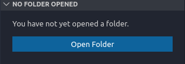

# Welcome to the p5.js graphics on the web workshop!

## Workshop Outline
1. Intro to p5.js.
    - What is it?
    - Where does it come from?
    - How does work?
2. Things you can make with p5.js
    - [Examples](https://p5js.org/examples/)
3. Get started!
    - [p5.js Home Page](https://p5js.org/)
    - Go to web editor
4. What is the p5.editor?
    - How does work?
    - What is loading in?
    - What are we making?
        - Froggy app
        - Linear interpolation
        - Mouse as fly
        - Mini-game

## Steps
1. Download this repository by first getting git on your computer and doing git clone https://github.com/xav-ie/froggy.git
2. Open the folder download in your editor of choice
3. Go to the index.html file, let's review how everything is working
    - Make preload --> load in the image
    - Make setup --> set the img variable
    - Draw image to canvas (don't forget to make the canvas!)
    - You may need to run a server for this to work
    - Move image based on mouseX and mouseY
    - slow down the frog
    - introduce collision detection with the mouse
    - have game stop on collision
    - game done! 

## Setting up a local server with VSCode 
Simply go to the extension store and download the "Live Server" extension. After that, make sure that your current folder is actually in the scope of VSCode. If you see this:

... then please open your current folder in VSCode.
Then, you will notice (upon opening index.html) a new "Go Live" button has appeared in the bottom right of VSCode. Click it and a browser will open with your index.html loaded!

## Setting up a general local server
- I understand not everyone loves VScode as much as me, so here is how one would run a server without it. You will need Python installed to do this. 
Once you have Python installed, open a terminal in the "froggy" folder. 
- In Windows, this can be accomplished by right clicking in an empty space in the file explorer and clicking "Open Terminal Here". 
- In Mac, open Finder and navigate to Froggy. Click on "Finder">"Services">"New Terminal at Folder".
- Once opened in the froggy folder simply run ```python -m SimpleHttpServer 8080``` and navigate to ```localhost:8080``` in your web browser of choice. Congrats, you have a local server that does not block CORS request!

## Next steps
- make the mouse a fly
- make froggy eyes
- perhaps have frog stay in place in it "casts" out a tongue!
- make object oriented!